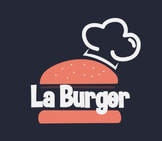

  <h1>La Burguer</h1>

  

 

# Contenido

* [Descripción del Producto](#Descripción-del-Producto)
     * [Tecnologías Usadas.](#Tecnologías-Usadas.)
     * [Roles de los usuarios.](#Roles-de-los-usuarios)
* [Producto Terminado](#Producto-Terminado)
    * [Credenciales.](#Credenciales)
* [Historias de Usuarios](#Historias-de-Usuarios)
* [Test Unitario](#Test-Unitario)
* [Autores](#Autores)

# Descripción de Producto

LaBurguer es una *single page application (SPA)* desarrollado usando *React* para un restaurante de hamburguesas. Nuestra aplicación es una interfaz con estado sincrónico para la gestión de las operaciones del restaurante, las funcionalidades a las que es posible acceder dependerán del perfil de usuario que se asigne al momento del registro.

El diseño de nuestra aplicación tiene como concepto el diseño web optimizado para Tablets y Smartphones. 

## *Tecnologías Usadas.*
 

## *Roles de los usuarios.*

* **Administrador:** El alcance de su acceso incluye creación de usuarios, actualización del registro de usuario y la visualización del estado de las ordenes generadas en las operaciones del restaurante.
* **Mesero:** El alcance de su acceso incluye tomar pedidos y editarlos antes de crear la orden. El mesero tiene acceso a el set de ordenes listas para entregar a la mesa y al historial de ordenes entregadas. 
* **Chef** El alcance de su acceso incluye ver la lista de ordenes enviadas por el mesero que necesitan ser preparadas, puede marcarlas como listas adicionalmente puede ver el historial de ordenes entregadas y el record de tiempo que tomó prepararlas.

# Producto terminado.

## *Credenciales de acceso:*
* mesero@laburguer.xyz
* chef@laburguer.xyz

* Contraseña: 123456 

*Vista Login.*

*Vista Administrador.*

*Vista Mesero.*

*Vista Chef.*

# Historias de Usuario

- **HU 1:** Mesero(a) debe poder ingresar al sistema, si el administrador ya le ha asignado credenciales. *"Yo como mesero(a) quiero poder ingresar al sistema de pedidos."*
- **HU 2:** Mesero(a) debe poder tomar pedido de cliente. *"Yo como mesero(a) quiero tomar el pedido de un cliente para no depender de mi mala memoria, para saber cuánto cobrar, y enviarlo a la cocina para evitar errores y que se puedan ir preparando en orden."*
- **HU 3:** Jefe de cocina debe ver los pedidos. *"Yo como jefe(a) de cocina quiero ver los pedidos de los clientes en orden y marcar cuáles están listos para saber qué se debe cocinar y avisar a los meseros que un pedido está listo para servirlo a un cliente."*
- **HU 4:** Mesero(a) debe ver pedidos listos para servir. *"Yo como mesero(a) quiero ver los pedidos que están preparados para entregarlos rápidamente a los clientes que las hicieron."*
- **HU 5:** Administrador(a) de tienda debe administrar a sus trabajadores.
*"Yo como administrador(a) de tienda quiero gestionar a los usuarios de la plataforma para mantener actualizado la información de mis trabajadores."*
# Test Unitarios (gitHub actions)

# Autores
 Developers | Contact |
| ------------- | ------------- |
| **Nathaly Huerta** |   |
| **Ana Margarita García**|   |